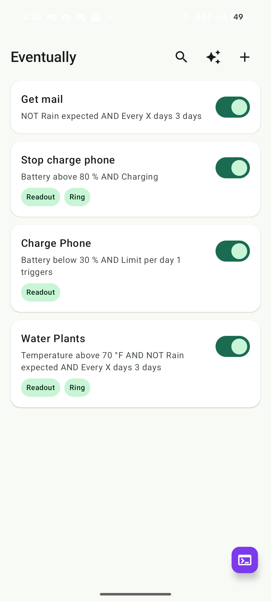
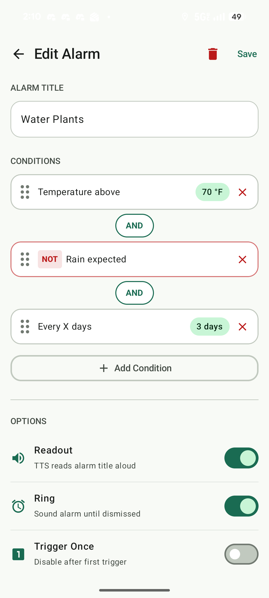
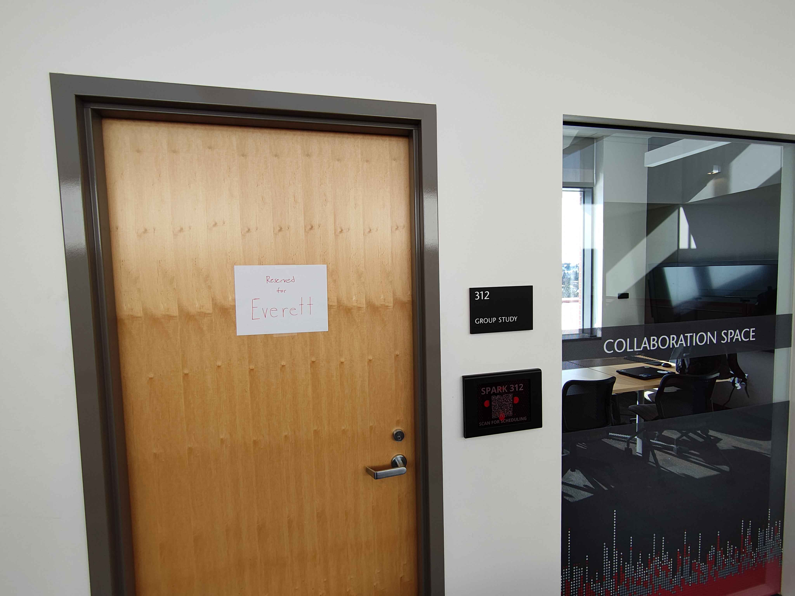
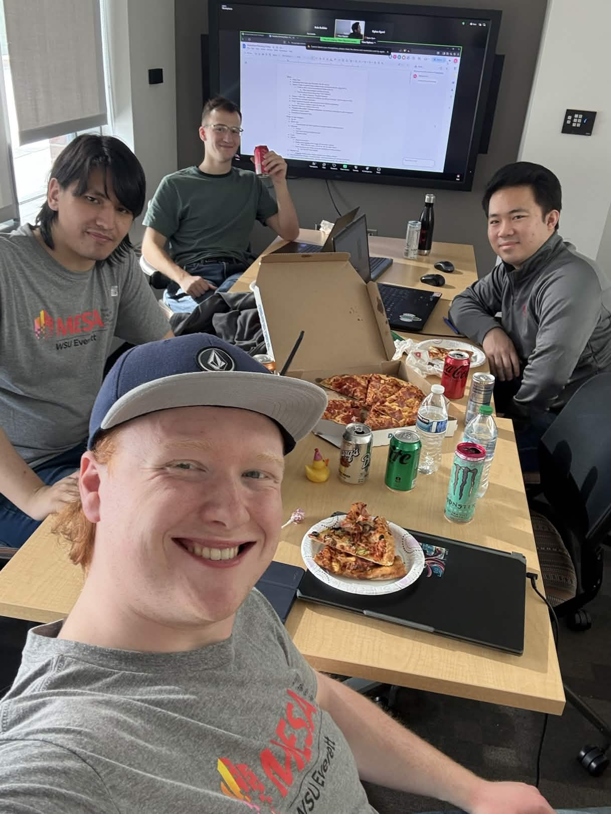
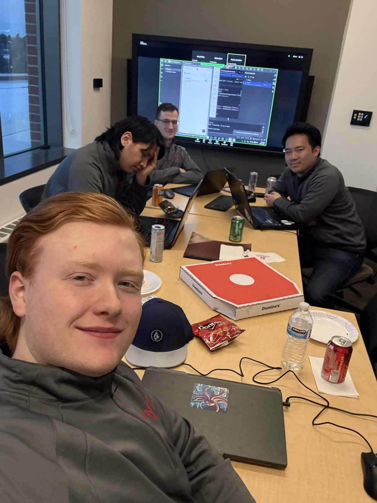
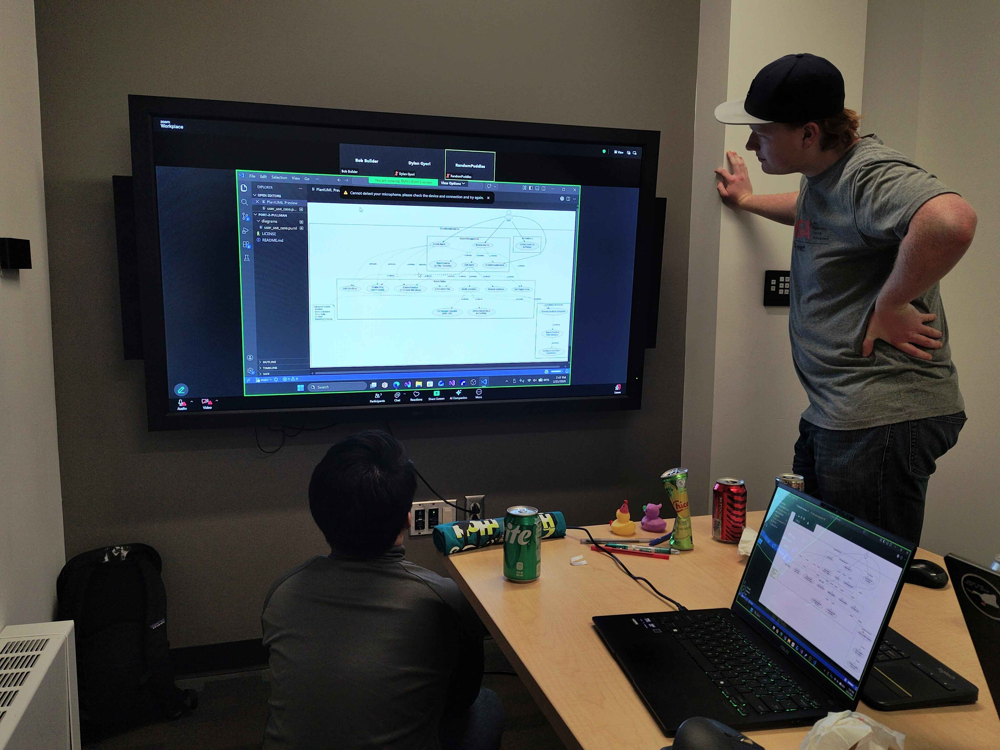

# Port-2-Pullman

## Description

**Conditional Alarms (Eventually)** — a submission for the Crimson Code Hackathon, themed **"Reinventing the Wheel"**.

We reinvented the alarm app. Traditional alarms are triggered by time alone. Our app allows alarms to be triggered by a combination of conditions — including **weather**, **location**, and **device attributes**. Each condition can be mixed and matched, and when the combined result evaluates to `true`, the alarm fires.

---

## Tech Stack

- **Kotlin**
- **Jetpack Compose**
- **Coroutines / Flow**
- **Android Studio**
- **Room**
- **Moshi**

---

## How to Run

### Option 1 — Install on a Physical Android Device (APK)

> Requires Android 14 (API 34) or higher.

1. Download the APK: [Google Drive Download](https://drive.google.com/file/d/1w4ClsE1UHZrbLu1hd4sUqciByfU8uCnU/view?usp=sharing)
2. Transfer the `.apk` file to your Android device (via USB, Google Drive, email, etc.)
3. On your device, open the file and tap **Install**
   - If prompted, enable **Install from unknown sources** under `Settings → Security`
4. Launch **Port-2-Pullman** from your app drawer

---

### Option 2 — Run on PC via Emulator (APK)

> Requires Android Studio with an emulator set up.

1. Download the APK: [Google Drive Download](https://drive.google.com/file/d/1w4ClsE1UHZrbLu1hd4sUqciByfU8uCnU/view?usp=sharing)
2. Install [Android Studio](https://developer.android.com/studio)
3. Open **Device Manager** in Android Studio and create a virtual device with **API 34+**
4. Start the emulator
5. Drag and drop the `.apk` file onto the running emulator window — it will install automatically
6. Open the app from the emulator's app drawer

---

### Option 3 — Build and Run from Source

> Requires Android Studio and Android SDK (API 34+).

1. Clone the repository:

   ```bash
   git clone https://github.com/RandomPuddles/Port-2-Pullman.git
   cd Port-2-Pullman
   ```

2. Create a `secrets.properties` file in the project root:

   ```
   GEMINI_API_KEY=your_gemini_api_key_here
   ELEVENLABS_API_KEY=your_elevenlabs_api_key_here
   ```

   > You can leave the values blank to build without AI/TTS features.

3. Connect a physical device via USB (with USB Debugging enabled) **or** start an Android emulator

4. Build and install:

   ```bash
   ./gradlew installDebug
   ```

5. Launch the app on your device or emulator

---

## Media

### Screenshots

  
Main Screen Screenshot

  
Edit Alarm Screenshot

### Proof of Participation


Our Everett Reserved Room!


First few hours into the Hackathon


~12 hours into the Hackathon


Trying to not lose it.

---

## Reflection

### Activity Description

The expectation for Crimson Code was to deliver a near-complete project that clearly fit the hackathon theme within a 24-hour window. Our team chose to reinvent the alarm app, moving beyond time-only triggers to a conditional model where alarms fire based on combinations of weather, location, and device attributes. The goal was a functional application that demonstrated the concept.

### Technical Decisions

Our most important technical decision was adopting an AI-augmented, planning-heavy workflow proposed by one of my teammates. Rather than jumping straight into code, we spent a great amount of time upfront creating structured planning materials that would be easy for AI models to read and work with.
The process worked as follows: we first came up with use cases as a group, then fed them into an AI model to generate PlantUML use case diagrams. After reviewing and refining those diagrams together, they were used to prompt an AI model to produce an HTML, CSS, and JS prototype. The prototype was tuned together on a single machine to avoid merge conflicts, and once we were happy with it, all three files were passed into Claude Opus to kick off the actual codebase. From there, the team continued building and adjusting features through AI-assisted coding.
The core idea behind this approach was that clear, structured planning materials give an AI model much better direction than loose prompts, leading to higher quality generated code with less back-and-forth.

### Contributions

The project was built within a 4-person team. The workflow was heavily collective by design, with most work happening in a shared space using a pair programming style rather than split individual tasks. My contributions were focused in the planning phases: coming up with and refining use cases, reviewing the PlantUML diagrams to make sure the logic made sense, and adjusting the HTML prototype to match what we wanted the app to do.


### Quality Assessment

The approach was interesting and produced solid results. However, individual participation is hard to show clearly on its own, since the collective nature of the workflow means most of my effort went into shared decisions rather than individual outputs.
If this were to be redone, a push for a setup that keeps the group planning phase but adds a clear point where work is split across individual machines. This would keep the benefit of everyone being on the same page, while also creating a clearer record of individual contributions and likely speeding up the coding phase. The positive of the workflow we used was that working on one machine reduced merge issues, and guarantee that everyone is on the same page, but became a bottleneck later on.
